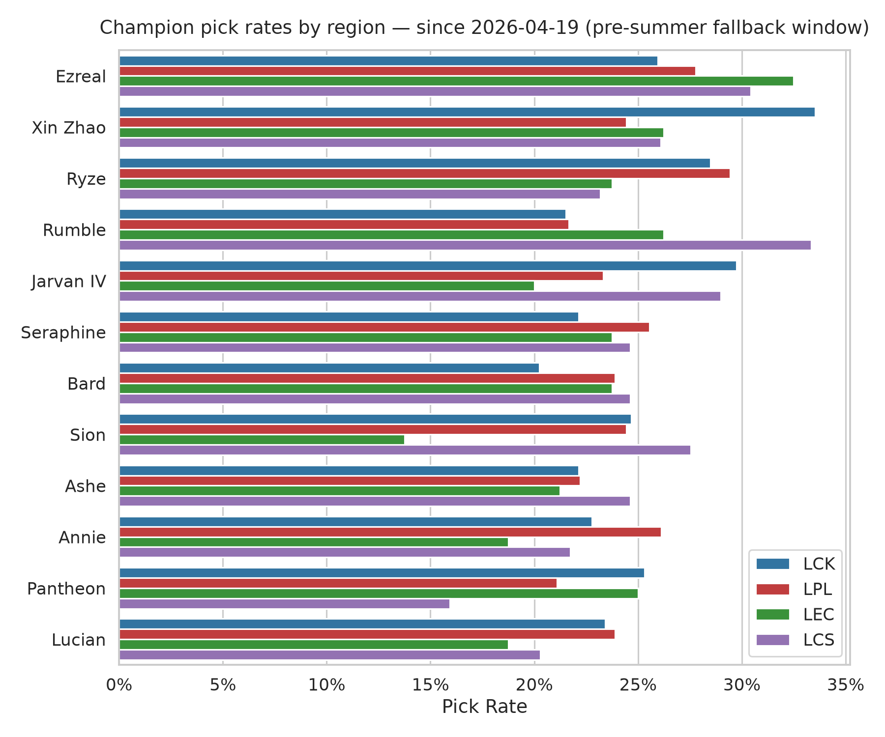
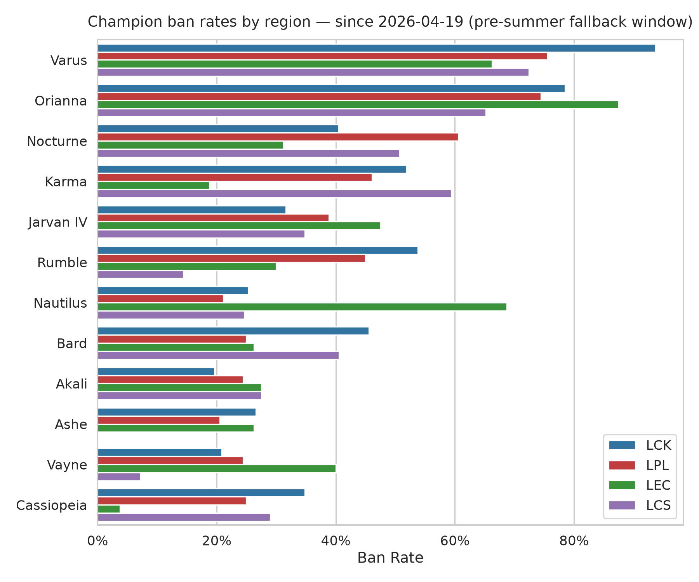
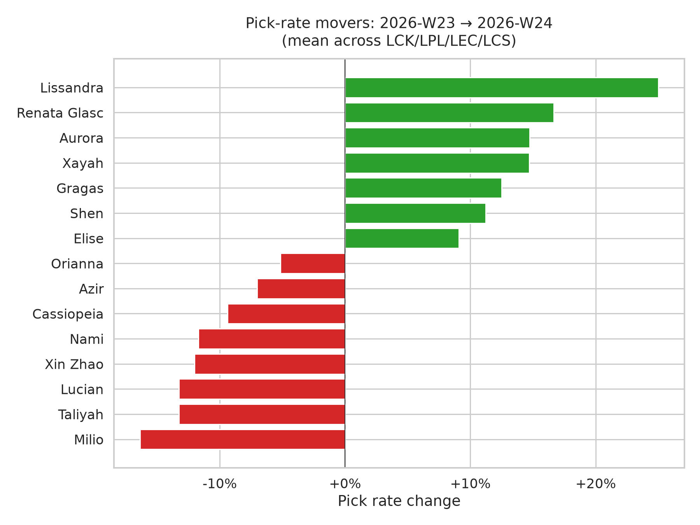

# Cross-League Meta Report — 2026-07-19

Games from **2026-04-19** through **2026-06-14**.

> ⚠️ No games on/after 2026-07-22 yet; using most recent 8 weeks. Summer split coverage begins once leagues start (LPL Jul 22 → LCK Jul 29).

## Games analyzed

| League | Games |
|---|---|
| LCK | 158 |
| LPL | 180 |
| LEC | 80 |
| LCS | 69 |

## Charts

## Cross-league pick rates (top 15 by mean)

| Champion | LCK | LPL | LEC | LCS | Mean |
|---|---|---|---|---|---|
| Ezreal | 26% | 28% | 32% | 30% | 29% |
| Xin Zhao | 34% | 24% | 26% | 26% | 28% |
| Ryze | 28% | 29% | 24% | 23% | 26% |
| Rumble | 22% | 22% | 26% | 33% | 26% |
| Jarvan IV | 30% | 23% | 20% | 29% | 26% |
| Seraphine | 22% | 26% | 24% | 25% | 24% |
| Bard | 20% | 24% | 24% | 25% | 23% |
| Sion | 25% | 24% | 14% | 28% | 23% |
| Ashe | 22% | 22% | 21% | 25% | 23% |
| Annie | 23% | 26% | 19% | 22% | 22% |
| Pantheon | 25% | 21% | 25% | 16% | 22% |
| Lucian | 23% | 24% | 19% | 20% | 22% |
| Lulu | 21% | 22% | 22% | 16% | 20% |
| Vi | 20% | 22% | 22% | 16% | 20% |
| Gnar | 24% | 19% | 22% | 14% | 20% |

## LCK

**Top picks**

| Champion | Rate | Games |
|---|---|---|
| Xin Zhao | 34% | 53 |
| Jarvan IV | 30% | 47 |
| Ryze | 28% | 45 |
| Ezreal | 26% | 41 |
| Pantheon | 25% | 40 |
| Sion | 25% | 39 |
| Gnar | 24% | 38 |
| Lucian | 23% | 37 |
| Annie | 23% | 36 |
| Jayce | 23% | 36 |

**Top bans**

| Champion | Rate | Games |
|---|---|---|
| Varus | 94% | 148 |
| Orianna | 78% | 124 |
| Rumble | 54% | 85 |
| Karma | 52% | 82 |
| Bard | 46% | 72 |
| Nocturne | 41% | 64 |
| Cassiopeia | 35% | 55 |
| Jarvan IV | 32% | 50 |
| Jayce | 30% | 47 |
| Caitlyn | 28% | 45 |

## LPL

**Top picks**

| Champion | Rate | Games |
|---|---|---|
| Ryze | 29% | 53 |
| Ezreal | 28% | 50 |
| Annie | 26% | 47 |
| Seraphine | 26% | 46 |
| Sion | 24% | 44 |
| Xin Zhao | 24% | 44 |
| Bard | 24% | 43 |
| Lucian | 24% | 43 |
| Milio | 24% | 43 |
| Jarvan IV | 23% | 42 |

**Top bans**

| Champion | Rate | Games |
|---|---|---|
| Varus | 76% | 136 |
| Orianna | 74% | 134 |
| Nocturne | 61% | 109 |
| Karma | 46% | 83 |
| Rumble | 45% | 81 |
| Jarvan IV | 39% | 70 |
| Lucian | 29% | 52 |
| Vi | 28% | 50 |
| Bard | 25% | 45 |
| Cassiopeia | 25% | 45 |

## LEC

**Top picks**

| Champion | Rate | Games |
|---|---|---|
| Ezreal | 32% | 26 |
| Nami | 28% | 22 |
| Rumble | 26% | 21 |
| Xin Zhao | 26% | 21 |
| Pantheon | 25% | 20 |
| Azir | 24% | 19 |
| Bard | 24% | 19 |
| Caitlyn | 24% | 19 |
| Ryze | 24% | 19 |
| Seraphine | 24% | 19 |

**Top bans**

| Champion | Rate | Games |
|---|---|---|
| Orianna | 88% | 70 |
| Nautilus | 69% | 55 |
| Varus | 66% | 53 |
| Jarvan IV | 48% | 38 |
| Vayne | 40% | 32 |
| Pantheon | 36% | 29 |
| Nocturne | 31% | 25 |
| Sion | 31% | 25 |
| Rumble | 30% | 24 |
| Akali | 28% | 22 |

## LCS

**Top picks**

| Champion | Rate | Games |
|---|---|---|
| Rumble | 33% | 23 |
| Ezreal | 30% | 21 |
| Jarvan IV | 29% | 20 |
| Sion | 28% | 19 |
| Xin Zhao | 26% | 18 |
| Ashe | 25% | 17 |
| Bard | 25% | 17 |
| Seraphine | 25% | 17 |
| Ryze | 23% | 16 |
| Annie | 22% | 15 |

**Top bans**

| Champion | Rate | Games |
|---|---|---|
| Varus | 72% | 50 |
| Orianna | 65% | 45 |
| Karma | 59% | 41 |
| Nocturne | 51% | 35 |
| Bard | 41% | 28 |
| Anivia | 36% | 25 |
| Jarvan IV | 35% | 24 |
| Cassiopeia | 29% | 20 |
| Akali | 28% | 19 |
| Seraphine | 28% | 19 |

---
_Data: [Oracle's Elixir](https://oracleselixir.com). Note: some 2026 draft/champion-select data has known issues pending upstream fix._
