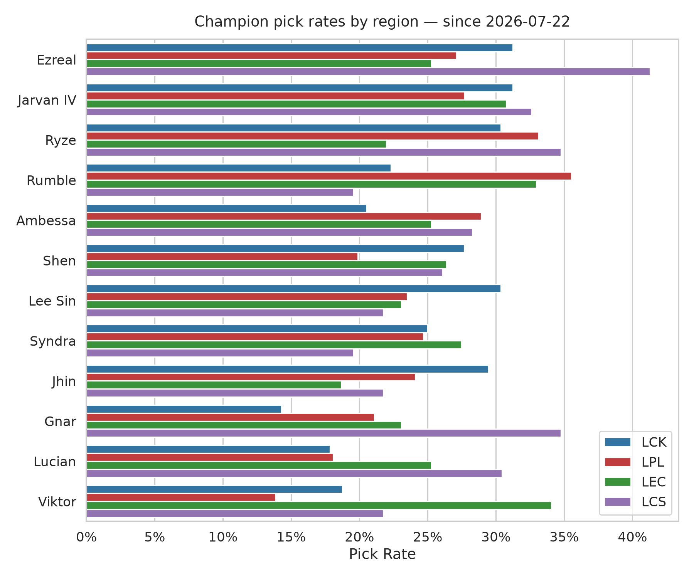
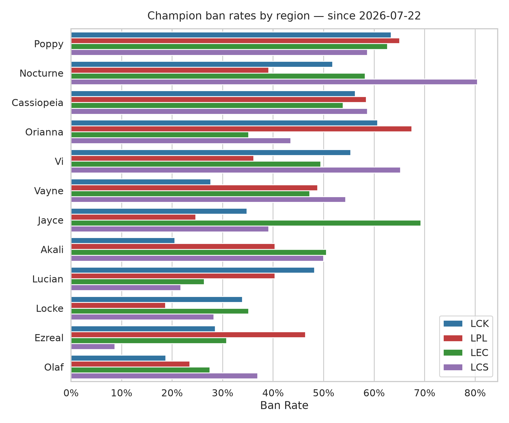
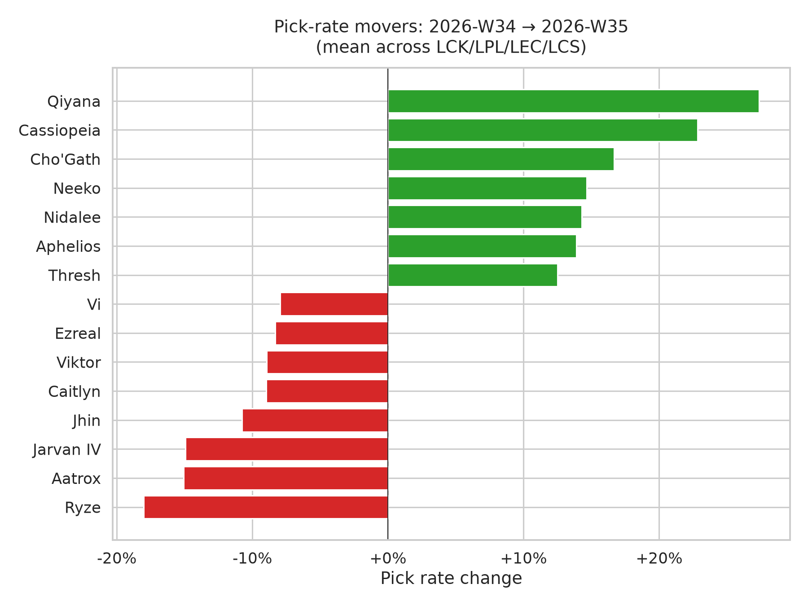

# Cross-League Meta Report — 2026-08-28

Games from **2026-07-22** through **2026-08-28**.

## Games analyzed

| League | Games |
|---|---|
| LCK | 112 |
| LPL | 166 |
| LEC | 91 |
| LCS | 46 |

## Charts

## Cross-league pick rates (top 15 by mean)

| Champion | LCK | LPL | LEC | LCS | Mean |
|---|---|---|---|---|---|
| Ezreal | 31% | 27% | 25% | 41% | 31% |
| Jarvan IV | 31% | 28% | 31% | 33% | 31% |
| Ryze | 30% | 33% | 22% | 35% | 30% |
| Rumble | 22% | 36% | 33% | 20% | 28% |
| Ambessa | 21% | 29% | 25% | 28% | 26% |
| Shen | 28% | 20% | 26% | 26% | 25% |
| Lee Sin | 30% | 23% | 23% | 22% | 25% |
| Syndra | 25% | 25% | 27% | 20% | 24% |
| Jhin | 29% | 24% | 19% | 22% | 23% |
| Gnar | 14% | 21% | 23% | 35% | 23% |
| Lucian | 18% | 18% | 25% | 30% | 23% |
| Viktor | 19% | 14% | 34% | 22% | 22% |
| Orianna | 20% | 16% | 29% | 24% | 22% |
| Vi | 20% | 26% | 23% | 20% | 22% |
| Naafiri | 20% | 31% | 15% | 17% | 21% |

## LCK

**Top picks**

| Champion | Rate | Games |
|---|---|---|
| Ezreal | 31% | 35 |
| Jarvan IV | 31% | 35 |
| Lee Sin | 30% | 34 |
| Ryze | 30% | 34 |
| Jhin | 29% | 33 |
| Olaf | 28% | 31 |
| Shen | 28% | 31 |
| Syndra | 25% | 28 |
| Pantheon | 24% | 27 |
| Jayce | 22% | 25 |

**Top bans**

| Champion | Rate | Games |
|---|---|---|
| Poppy | 63% | 71 |
| Orianna | 61% | 68 |
| Cassiopeia | 56% | 63 |
| Vi | 55% | 62 |
| Nocturne | 52% | 58 |
| Lucian | 48% | 54 |
| Camille | 45% | 50 |
| Bard | 41% | 46 |
| Jayce | 35% | 39 |
| Locke | 34% | 38 |

## LPL

**Top picks**

| Champion | Rate | Games |
|---|---|---|
| Rumble | 36% | 59 |
| Ryze | 33% | 55 |
| Naafiri | 31% | 52 |
| Ambessa | 29% | 48 |
| Jarvan IV | 28% | 46 |
| Ezreal | 27% | 45 |
| Vi | 26% | 43 |
| Syndra | 25% | 41 |
| Jhin | 24% | 40 |
| Seraphine | 24% | 40 |

**Top bans**

| Champion | Rate | Games |
|---|---|---|
| Orianna | 67% | 112 |
| Poppy | 65% | 108 |
| Cassiopeia | 58% | 97 |
| Vayne | 49% | 81 |
| Ezreal | 46% | 77 |
| Akali | 40% | 67 |
| Lucian | 40% | 67 |
| Nocturne | 39% | 65 |
| Vi | 36% | 60 |
| Nautilus | 32% | 53 |

## LEC

**Top picks**

| Champion | Rate | Games |
|---|---|---|
| Viktor | 34% | 31 |
| Rumble | 33% | 30 |
| Jarvan IV | 31% | 28 |
| Orianna | 29% | 26 |
| Syndra | 27% | 25 |
| Shen | 26% | 24 |
| Ambessa | 25% | 23 |
| Ezreal | 25% | 23 |
| Leona | 25% | 23 |
| Lucian | 25% | 23 |

**Top bans**

| Champion | Rate | Games |
|---|---|---|
| Jayce | 69% | 63 |
| Poppy | 63% | 57 |
| Nocturne | 58% | 53 |
| Cassiopeia | 54% | 49 |
| Akali | 51% | 46 |
| Vi | 49% | 45 |
| Vayne | 47% | 43 |
| Locke | 35% | 32 |
| Orianna | 35% | 32 |
| Ezreal | 31% | 28 |

## LCS

**Top picks**

| Champion | Rate | Games |
|---|---|---|
| Ezreal | 41% | 19 |
| Gnar | 35% | 16 |
| Ryze | 35% | 16 |
| Jarvan IV | 33% | 15 |
| Lucian | 30% | 14 |
| Ambessa | 28% | 13 |
| Milio | 26% | 12 |
| Nautilus | 26% | 12 |
| Shen | 26% | 12 |
| Jayce | 24% | 11 |

**Top bans**

| Champion | Rate | Games |
|---|---|---|
| Nocturne | 80% | 37 |
| Vi | 65% | 30 |
| Cassiopeia | 59% | 27 |
| Poppy | 59% | 27 |
| Vayne | 54% | 25 |
| Akali | 50% | 23 |
| Lee Sin | 46% | 21 |
| Orianna | 43% | 20 |
| Jayce | 39% | 18 |
| Olaf | 37% | 17 |

---
_Data: [Oracle's Elixir](https://oracleselixir.com). Note: some 2026 draft/champion-select data has known issues pending upstream fix._
